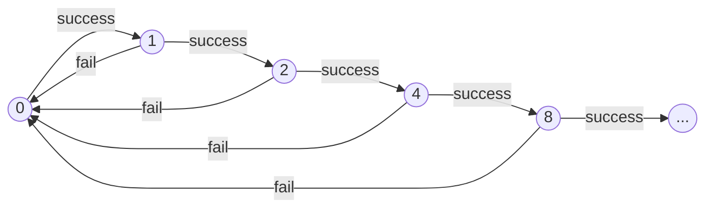
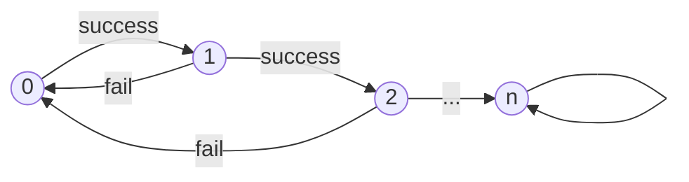

# Design Notes

## Upgrade Balancing

I wanted to have upgrades require an unlock because I feel like it keeps the beginning of the game simpler, and makes random events happening more rewarding. Unlocks are not related to progression, but instead achievements that require doing something related to what the upgrade offers.

### Available Upgrades
Arbitrary caps subject to change after more playtesting. Data copied from `src/pages/lucky-dice/constants.ts`.

| ID | Result of Upgrade | Unlock Condition | Count Available | Notes |
| :---: | --- | --- | :---: | --- |
| `more-dice` | +1 extra die | Roll 10 times | 4 | Arbitrary cap, similar to yahtzee |
| `faster-rolling` | Reduced roll time | Click rolling die (anytime, estimated accident after ~10 rolls) | 5 | Arbitrary splitting (without massive jump) of what seems permissible but long, to the time it takes to start rolling all other dice |
| `less-numbers` | -1 die side | 10 rolls without success | 5 / 18 | Different counts in "easy"/hard mode, "easy" goes all the way to only one possible, hard only goes to just 2 possible |
| `higher-payout` | +1 success point | 15 successes | 4 | Arbitrary cap |
| `streak-multiplier` | +1 to successive success multiplier | 2 consecutive success | 4 | Arbitrary cap; risk of exponential growth |
| `your-lucky-number` | Allow changing lucky number | Roll each number once | 1 | Purely superstitious (and reqauired for some achievements) |
| `stats` | Unlock stats tab | View info screen | 1 | Permanent |
| `hard-mode` | Unlock hard mode | Have 100 points | 1 | Permanent |
| `winner` | Win the game | Be in hard mode | 1 | **Not** permanent, but has achievement; only upgrade that is relockable, via switching off hard mode |

Note that `faster-rolling` achieves the exact same thing as `more-dice`, but each is more effective at different points of the game:

- `faster-rolling`: as it is a constant value subtracted at each level, it is more effective when roll time is already low; in late game
- `more-dice`: allows concurrent rolls, so single addition more effective when less concurrent rolls already available

### Flow
- `hard-mode` should be the last purchase in "easy"
- `winner` should be the last purchase in hard
- `stats` should be purchaseable early
- `hard-mode` should be unlocked (via have 100 points at once) around the time each upgrade has purchased once so players know it is a goal
- `less-numbers` should not be purchaseable too early to make it harder to lock out of some achievements accidentally
- `more-dice` is very similar to `faster-rolling`, so interleave them (more effective at opposite upgrade quantities)
- Offering choice of making streaks easier to achieve or making streaks more valuable is interesting
- Delay endless growth by putting high-level multiplier and side-reduction upgrades at end

### Upgrade Structure: Attempt 1

Selected prices based on how valuable I felt they were when I came up with the idea for the upgrade, then arbitrarily increased the price for each level.

Prices for hard mode were not created before the next attempt was started.

|Upgrade Name|Lvl. 1 Cost|Lvl. 2 Cost|Lvl. 3 Cost|Lvl. 4 Cost|Lvl. 5 Cost|
| :---: | :---: | :---: | :---: | :---: | :---: |
| `more-dice` |5|10|20|40|-|
| `faster-rolling` |3|10|20|40|80|
| `less-numbers` |15|30|60|120|240|
| `higher-payout` |20|40|80|160|-|
| `streak-multiplier` |25|50|100|200|-|
| `your-lucky-number` |20|-|-|-|-
| `stats` |10|-|-|-|-|
| `hard-mode` |100|-|-|-|-|
| `winner` |500|-|-|-|-|

#### Attempt 1 Result
| Good | Bad |
| :--- | :--- |
|Decent choice in what to upgrade when|Some large gaps between upgrades|
|Simple|Scaling near end is poor|

### Upgrade Structure: Attempt 2
This attempts to improve over [attempt 1](#upgrade-structure-attempt-1) by:
- Structured, intentional order; pricing relative to pricing of other upgrades
- Rationale behind pricing; something other than just 2x each level

#### Ideal Upgrade Offer Order

This serves as a guide for determining upgrade prices, based on the order I feel the upgrades should be purchased or be available to purchase, then sometimes slightly adjusted based on how much of an effect each would have on the expected amount of points gained. Completed based on my own experience playtesting, specific upgrade decisions I want to offer, and how I expect people to feel about the game.

Table explanation:
- Bold font is max level, italic font is hard mode only 
- The farther down in the chart, the farther into the game it should be available
- Cell filled by upgrade level for clarity
- Same row filled in multiple columns should be comparable cost 
- Ellipses indicate large cost jumps
- EPPM = Expected Points Per Minute (EPPM); values in parentheses indicate value if only one upgrade in a row is purchased

| `m-d` | `f-r` | `l-n` | `h-p` | `s-m` | `y-l-n` | `s` | `h-m` | `w` | EPPM (Easy) | EPPM (Hard) |
| :---: | :---: | :---: | :---: | :---: | :---: | :---: | :---: | :---: | :---: | :---: |
| | | | | | | | | |3.33|1|
| |1| | | | | | | |4|1.2|
| |2| | | | | | | |5|1.5|
| | | |1| | |**1**| | |10|3|
|1| | | | |**1**| | | |20|6|
| | | |2| | | | | |30|9|
| |3| | | | | | | |40|12|
| | |1| |1| | | | |(48 / 50) 64|(12.6 / 12.7) 13.4|
|2| | | | | | | | |96|20.1|
| | |2| |2| | | | |(135 / 143.8) 266.8|(21.2 / 21.3) 22.7|
|3| | | | | | | | |355.7|30.2|
| |4| |3| | | | | |(533.6 / 474.3) 711.4|(45.3 / 40.3) 60.4|
| | |3| | | | | | |4160|64.5|
|**4**| | | | | | | | |5200|80.7|
| |**5**| |**4**|3| | | | |(10,400 / 6500 / 212,052.3) 530,130.9|(161.3 / 100.8 / 86.9) 217.2|
| | | | |**4**| | | | |19,691,800.8|235.3|
| | |4| | | | | | |6.9 * 10^14|255.6|
|||...|||||...|...|||
| | |**5-*18***| | | | | | |∞|279.9 ... 6.9 * 10^14|
||||||||...|...|||
| | | | | | | |**1**| |n/a|n/a|
| | | | | | | | |***1***|n/a|n/a|

##### Expected Points Per Minute
Expected Points Per Minute (EPPM) in the above table is calculated as if player has average luck, has purchased all upgrades up to that row, and no die has any downtime.

###### Difficulty Drift
The EPPM drifts apart between "easy" and hard mode mostly due to the difference in sides (it is the purpose of hard mode though). The `less-numbers` upgrade has a much higher effect when amount of sides is low (higher upgrade level):

- "Easy" mode first upgrade adds 3.33% to success chance (20% increase)
- Hard mode first upgrade adds 0.263% to success chance (5.26% increase)
- Penultimate upgrade (both difficulties) adds 16.6% to success chance (50% increase)
- Final upgrade (only available in "easy") adds 50% to success chance, reaching 100% (100% increase)

And, as the amount of sides in hard mode is much higher, the drastic increase in chances of success land at a much higher upgrade level. Additionally, the `streak-multiplier` upgrade has a much weaker effect in hard mode as you are more likely to fail at the same `less-number` upgrade level. 

###### Pre-`streak-multiplier` Upgrade EPPM Calculation
A roll is a Bernoulli trial and the expected points per roll (PPR) be calculated with a straightforward expected reward calculation:
$$
\begin{align*}
E[\mathrm{PPR}] &= \frac{1}{\mathrm{sides}} * (\mathrm{points/success}) + \frac{\mathrm{sides}-1}{\mathrm{sides}} * 0 \\
&= \frac{1}{\mathrm{sides}} * (\mathrm{points/success})
\end{align*}
$$
Therefore, per minute this becomes:
$$
E[\mathrm{PPM}] = \mathrm{dice} * \frac{60}{(\mathrm{seconds/roll})} * E[\mathrm{PPR}]
$$

<details>
<summary>Example calculation for no upgrades/at the start of the game</summary>

$$
\begin{align*}
E[\mathrm{PPM}] &= \mathrm{dice} * \frac{60}{(\mathrm{seconds/roll})} * \frac{1}{\mathrm{sides}} * (\mathrm{points/success}) \\
&= 1 * \frac{60}{3} * \frac{1}{6} * 1 \\
&= \frac{60}{18} = 3.\overline{3} \\
\end{align*}
$$
</details>

###### Post-`streak-multiplier` Upgrade EPPM Calculation
The previous equation can no longer be used at this point because now the expected reward of a roll is no longer an independent event (it depends on what the previous reward was). To model this, I used a markov chain where each state is another successful roll in sequence.

<details>
<summary>Example chain for base upgrades but streak-multiplier = 2</summary>


</details>
<br>

To calculate the expected reward of a roll, we can use a similar formula where `p_n` is a row vector of the steady-state probability of being at each node `n` and `r_n` is a column vector of the reward for visiting each node `n`:
$$
\begin{align*}
E[\mathrm{PPR}] &= \vec{p_n} \vec{r_n} \\
&= \begin{bmatrix}
    \mathrm{p(@n0)} &
    \mathrm{p(@n1)} &
    \mathrm{p(@n2)} &
    \mathrm{p(@n3)} &
    \cdots
  \end{bmatrix} 
  \begin{bmatrix}
    \mathrm{0} \\
    \mathrm{payout} \\
    \mathrm{payout} * \mathrm{multiplier} \\
    \mathrm{payout} * \mathrm{multiplier}^2 \\
    \vdots
  \end{bmatrix}
\end{align*}
$$
The above formula can also be used to obtain the same values as the pre-`streak-multiplier` if the multiplier is 1 (default/non-upgraded).

To determine `p_n`, I used the power method with Python. Briefly, the power method uses a transition probability matrix to define the probability of going to any node m from each node n, and then from some initial state probability vector (100% at node 0 in this case) it calculates the probability of being at any node by multiplying the matrix with the vector, then feeds back in the new state. This repeats until a specified amount of cycles have been completed, or the changes in state are sufficiently small (at which point you have reached "steady state" and can use the the state probability vector for the calculation above).

<details>
<summary>Example iteration of power method</summary>

This is effectively what the code below is doing repeatedly. Note that `π` is the aforementioned state probability vector (subscripted by iteration number, or no subscript for steady state; `π_0` is initial), and `T` is the transition probability matrix (does not change). `T` is created by filling in each cell with the answer to the question: "what is the chance of getting to node [column] from node [row]?"
$$
\begin{align*}
\pi &= \pi T \\
\\
\pi_1 &= \pi_0 T \\
\pi_1 &= \begin{bmatrix}
    1 &
    0 &
    0 &
    \cdots
  \end{bmatrix}
  \begin{bmatrix}
    \frac{\mathrm{sides}-1}{\mathrm{sides}} & \frac{1}{\mathrm{sides}} & 0 & 0 & \cdots \\
    \frac{\mathrm{sides}-1}{\mathrm{sides}} & 0 & \frac{1}{\mathrm{sides}} & 0 &  \\
    \frac{\mathrm{sides}-1}{\mathrm{sides}} & 0 & 0 & \frac{1}{\mathrm{sides}} &  \\
    \vdots &  &  &  & \ddots
  \end{bmatrix} \\
\pi_1 &= \begin{bmatrix}
    \frac{\mathrm{sides}-1}{\mathrm{sides}} &
    \frac{1}{\mathrm{sides}} &
    0 &
    \cdots
  \end{bmatrix} \\
\\
\pi_2 &= \pi_1 T \\
\vdots &
\end{align*}
$$
</details>

<details>
<summary>Code for calculating Markov chain steady-state probabilities</summary>

Built off of [Geeks for Geeks example](https://www.geeksforgeeks.org/dsa/steady-state-probabilities-in-markov-chains/).

```py
import numpy as np

# Generate the transition probability matrix of size required for amount of iterations
# (Each iteration adds possibility of one additional node)
def generate_t(n, sides):
    arr_list = []
    for i in range(n):
        arr = np.zeros(n)
        np.put(arr, 0, (sides-1)/sides)
        np.put(arr, min(i+1, n-1), 1/sides)
        arr_list.append(arr)
    p = np.array(arr_list)
    return p

# Generate reward vector
def generate_r(s, base, mult):
    r = [0]
    for i in range(s-1):
        r.append(base * mult**(i))
    return r

# Run power method on given transition matrix until change is less than tol or max_iter is reached
def steady_state_power_method(T, tol, max_iter):
    n = T.shape[0]
    pi = np.zeros(n)
    pi[0] = 1;
    
    for i in range(max_iter):
        new_pi = np.dot(pi, T)
        if np.linalg.norm(new_pi - pi) < tol:
            print(f"Change did not surpass tolerance at iteration {i}.")
            break
        pi = new_pi
    
    print(f"{i}/{max_iter} iterations completed.")
    return pi

# Perform all required calculations given parameters to determine expected reward per minute
def calculate(show_results, max_iter, base_reward, multiplier, dice, sides, roll_spd_s):
    T = generate_t(MAX_ITER, SIDES)
    R = generate_r(MAX_ITER, BASE_REWARD, MULTIPLIER)

    steady_probs = steady_state_power_method(T, tol=1e-9, max_iter=MAX_ITER)
    steady_preview = [round(i.item(), 5) for i in steady_probs[:5]] + ["..."]
    if show_results:
        print(f"Steady-State Probabilities (Power Method): {steady_preview}")

    expected = np.dot(steady_probs, R)
    if show_results:
        print(f"Expected reward per roll: {expected}")

    per_min = expected * DICE * (60/ROLL_SPD_S)
    if show_results:
        print(f"Expected reward per minute: {per_min}")
    
# GO
MAX_ITER = 100
BASE_REWARD = 1
MULTIPLIER = 1
DICE = 1
SIDES = 6
ROLL_SPD_S = 3

if __name__ == "__main__":
    calculate(True, MAX_ITER, BASE_REWARD, MULTIPLIER, DICE, SIDES, ROLL_SPD_S)
```

Example output (calculation for no upgrades/at the start of the game, same as first section):
```
Change did not surpass tolerance at iteration 11.
11/100 iterations completed.
Steady-State Probabilities (Power Method): [0.83333, 0.13889, 0.02315, 0.00386, 0.00064, '...']
Expected reward per roll: 0.16666666666666666
Expected reward per minute: 3.333333333333333
```
</details>

#### Upgrade Pricing
The goal is to have upgrades purchased on average not much more than a minute apart in easy mode. Using the EPPM from [the above table](#ideal-upgrade-offer-order), I created the following table listing how many points each upgrade level should cost (and how much tume it takes to afford them with all the cheaper upgrades purchased):

|Upgrade Name|Lvl. 1 Cost|Lvl. 2 Cost|Lvl. 3 Cost|Lvl. 4 Cost|Lvl. 5+ Cost|
| :---: | :---: | :---: | :---: | :---: | :---: |
| `more-dice` |6 (36s)|50 (~45s)|220 (~50s)|3800 (~55s)|-|
| `faster-rolling` |2 (36s)|3 (45s)|20 (40s)|325 (~55s)|5000 (~58s)|
| `less-numbers` |30 (45s)|80 (50s)|650 (~55s)|15,000,000 [15M] (~45s)|50,000,000,000 [50B] (<60)|
| `higher-payout` |5 (60s)|15 (45s)|290 (~50s)|4800 (~55s)|-|
| `streak-multiplier` |30 (45s)|80 (50s)|5200 (60s)|500,000 (~55s)|-|-|
| `your-lucky-number` |8 (48s)|-|-|-|-|
| `stats` |5 (60s)|-|-|-|-|
| `hard-mode` |1,000,000,000,000 [1T] (<60s)|-|-|-|-|
| `winner` |100,000,000,000,000 [100T] (<60s)|-|-|-|-|

Note that TypeScript's `Number.MAX_SAFE_INTEGER = 9007199254740991` (9 quadrillion), which is enough above the prices that it will still work. I could just use `bigint`, but you aren't supposed to mix that and non-`bigint` numbers, and I've already made the whole thing without it, so as of writing I plan on intentionally not making that fix since there is currently no negative effect.

I don't particularly care about the balancing in hard mode. Perhaps I will rename it stupid mode.

#### Attempt 2 Result
After some playtesting, my thoughts on the proposed structure are:

| Good | Bad |
| :--- | :--- |
| Simple playloop | *Forced* gradual progression |
| Early game felt good | Completely unreasonable for player to "skip" an upgrade |
| Big prices feel cool | Takes much longer than what I feel is a reasonable 30 minutes of playtime |
| Prices increase reasonably | Some upgrade intervals last the target minute or so, some took around eight minutes (inconsistent and too long; only one long gap can cause interest to be lost) |

At the root of the issue, there were some flaws in my original calculations:
- At 5 dice, already at 1 second roll time you are constantly clicking to keep all dice rolling; in other words, halving the roll time at that point does not double the amount of rolls per time interval as you cannot click fast enough to keep all die rolling
    - New upgrade planned to counteract this that will not affect calculation (convenience upgrade)
- EPPM calculations, especially once multiplier starts going up, is heavily skewed by the odd chance that a long run is rolled - which is unlikely to happen in the short term meaning prices are not attainable

Using a test script, I also determined that these prices were unreasonable. Taking a look at the last sides reduction upgrade for example:
- Base reward = 5 (`higher-payout` 4)
- Multiplier = 5 (`streak-multiplier` 4)
- Dice = 5 (`more-dice` 4)
- Sides = 2 (`less-numbers` 4)
- Roll speed seconds = 0.5 (`faster-rolling` 5)

At this point, the calculated EPPM was 6.9 * 10^14, or 690 trillion. The upgrade, to attempt to keep an illusion of meaningful price differences at that point, was priced at a modest 50 billion (theoretically achievable in fractions of a second). That is, of course, averages. Running the test script with a million trials for number of rolls equivalent to one minute:
- Max points: 1.863 * 10^18
- Min points: 10090
- Mean points: 1.287 * 10^13
- Median points: 1,049,117

This tells me that:
- Most games would not be able to afford the upgrades in a reasonable amount of time
- My original calculation was unsuitable for direct to-price conversion, but was not far off (if not correct altogether)
- A calculation method that tries to determine the median would result in a better experience for most games

### Upgrade Structure: Attempt 3

This attempts to improve over [attempt 2](#upgrade-structure-attempt-2) by:
- Re-evaluate EPPM calcuation (EPPM2) to result in more accurate pricing for 1 minute (or less) of gameplay based on runs that are likely to actually occur in the target time between upgrades
- Separate easy and hard prices; this will probably result in some "easy" mode prices being cheaper than hard mode prices, but makes hard mode actually playable
- Price upgrades objectively (*no* desired order) to allow progression choices

#### EPPM2: Expected Points Per Minute V2 Calculation

I will use the same Markov chain method for calculating the probability of reaching each node in steady state. However, I will do an additional preparation calculation to determine the probability of obtaining a success streak of at least `n` in `m` rolls. We know how many rolls we can do per minute since we know how many dice we have and how fast they roll, so we just need the probability of reaching a streak of length `n`.

Coincidentally, the easiest way of calculating this is with a cumulative density function (complement), which also makes it easy to determine what the longest streak will be in the median game. I can then go back to the first calculation, only consider nodes that are likely to show up, normalize them so we still get total probability equal to 1, and use *only* those nodes to determine EPPM (EPPM2).

It is worth noting that this strategy, due to manually removing chunks of the calculation, loses precision and may become unable to accurately calculate the correct value (i.e. the required probability changing either entirely includes or excludes a streak/node, meaning the expected reward will jump significantly depending on whether or not each node is included). However, the goal of this is to get closer to the right order of magnitude; being a few seconds off in lower upgrades is worth being minutes closer in higher upgrades.

Is this fully mathematically sound? Probably not. Will it achieve what I want? Hopefully - check if attempt 4 exists... 😅

<details>
<summary>EPPM2 Calculation</summary>

Unfortunately (or fortunately, if you like cleaner equations) I do not know enough mathematical notation to write this all out in one equation so here are the steps:

###### Formula 1: Expected Streak Steady State

See [Post-`streak-multiplier` Upgrade EPPM Calculation](#post-streak-multiplier-upgrade-eppm-calculation) for method of determining expected streak at any given roll in steady state.

###### Formula 2: Streak Reached Within a Minute in Median Game

Use markov chain again, with one modification - last node is absorbing. Other nodes remain as success advances one node, failure resets to first node. We can still keep the calculation as steady state (and not to `m`), as using the power method requires less iterations than what an `m` value would be. 

Use above graph to create transition probability matrix. Perform same iterative calculation as [Formula 1](#formula-1-expected-streak-steady-state) but only `m` times. Different notation as it makes it clearer here.
$$
\begin{align*}
\pi_m &= \pi_0 T^m \\
&= \begin{bmatrix}
    1 &
    0 &
    0 &
    \cdots
  \end{bmatrix}
  \begin{bmatrix}
    \frac{\mathrm{sides}-1}{\mathrm{sides}} & \frac{1}{\mathrm{sides}} & 0 & \cdots & 0 & 0 \\
    \frac{\mathrm{sides}-1}{\mathrm{sides}} & 0 & \frac{1}{\mathrm{sides}} & & 0 & 0 \\
    \frac{\mathrm{sides}-1}{\mathrm{sides}} & 0 & 0 & & 0 & 0 \\
    \vdots &  &  & \ddots & \vdots\\
    \frac{\mathrm{sides}-1}{\mathrm{sides}} & 0 & 0 & \cdots & 0 & \frac{1}{\mathrm{sides}} \\
    0 & 0 & 0 & & 0 & 1
  \end{bmatrix}^m
\end{align*}
$$
For `n` starting at 1, use formula, increase n, and repeat until final state probability is less than some value (0.3 by trial and error gives good values). Use the first `n` states from [Formula 1](#formula-1-expected-streak-steady-state) only when calculating expected value.

###### Example for No Upgrades

Observe `case "4"` in [`master.py`](/src/test-scripts/master.py).

```
Show progress logs? (y/n): y
Seconds of rolling (int): 60
Base reward (int): 1
Streak multiplier (int): 1
Number of dice (int): 1
Number of sides per die (int): 6
Die roll time in seconds (float): 3
Probability required to consider streak (float): 0.3

Rolls in 60s = 20

Change did not surpass tolerance at iteration 11.
11/100 iterations completed.
Steady-State Probabilities (Power Method): [0.83333, 0.13889, 0.02315, 0.00386, 0.00064, '...']
Expected reward per roll: 0.16666666666666666
Expected reward per minute (V1): 3.333333333333333

Probability of reaching streak: [1.0, 0.97392, 0.37551, 0.06862]
After 60s, longest streak with probability greater than 0.3 is 2.

Normalized likely steady-state probabilities: [0.83721, 0.13953, 0.02326]
Expected reward per roll: 0.1627906976744186
Expected reward per minute (V2): 3.2558139534883717
```

</details>

##### Benchmark

I ran the calculation for a few different upgrade configurations, comparing a simulation, EPPM1, and EPPM2. 
- I found that 0.3 was better than 0.5 as a probability threshold for when to exclude a steady state node, so I added a column for that as well (and it will probably be the value I will use for calculating prices later)
- All numbers are for 60s of constant rolling at current upgrades; that means at no upgrades the amount is for 20 (1 * 60 / 3) rolls, and at full upgrades it is for 600 (5 * 60 / 0.5) rolls
- All simulation results are from at least 100,000 trials
- I have ordered the columns to make comparing the mean from simulations to EPPM1 and the median from simulations to EPPM2 as that is what they were meant to calculate
- Values over 3 digits are rounded for clarity in this table, and at that point, decimal precision is not important

|Upgrade Configuration|Sim. Mean|EPPM1|Sim. Median|EPPM2 @ 0.3|EPPM2 @ 0.5|
| :--- | :---: | :---: | :---: | :---: | :---: |
|No upgrades|3.333|3.333|3|3.256|2.857|
|2 reward, 2 multiplier, 2 15-sided die, 2.5s roll time (random, basically)|6.876|6.892|6|6|6|
|All time reduction and score increase, but 6 sides|2238|2177|1125|1295|1054|
|3 reward, 4 multiplier, 4 3-sided die, 1s roll time (random, basically)|38,050|127,231|1434|1545|1041|
|All upgrades except last side (has 2 sides)|2.202 * 10^14|6.939 * 10^14|1,052,487|1,908,712|763,932

##### Other Notes

- **Why didn't I just use simulation means or medians directly for determining EPPM?**
    - Because it can be slower if you are averaging a lot of trials, and I wanted something deterministic.

#### Upgrade Pricing/Order

If I have no specific order in mind, I do not know what current upgrades are already purchased. Therefore, I do not have a concrete idea of the value of an upgrade (e.g. multiplier upgrades are more immediately valuable when there are less sides). Here are a few options I considered:

##### Idea 1: Full Dynamic Pricing 
Price an upgrade relative to current EPPM2 and how much of an improvement in EPPM2 it provides. For example, 0.5 EPPM2 + 0.1 EPPM2'.

| Good | Bad |
| :--- | :--- |
| Full player choice of what upgrade to purchase | Arbitrary efficiency:price ratio |
|| To achieve this correctly, will need to update prices for upgrades mid-game which could be confusing to player |

Not pursuing this option as it is too confusing to the player in my opinion.

##### Idea 2: Dynamic Pricing On Available
Anytime an upgrade is made available (unlocked or previous level purchased), price it at 1 EPPM2. 

| Good | Bad |
| :--- | :--- |
| Should never take too long to purchase an upgrade | Does not take into account effectiveness after an upgrade, meaning you can always jump ahead if you know the best upgrades |
| Full player choice of what upgrade to purchase (at least initially) | Would require adding prices to save file |

Not pursuing this option as it messes with replayability in my opinion (due to confusion).

##### Idea 3: Assume Other Purchased Upgrades
1. Determine a baseline effectiveness for each upgrade (i.e. no other upgrades purchased, what does this upgrade at this level do to EPPM2?)
2. Calculate effectiveness of each upgrade and tier assuming all other upgrades purchased to the highest-EPPM2 less than upgrade in calculation's EPPM2, by using previous iterations
3. Repeat 2 until steady state
4. Price upgrades at 1 EPPM2 at same upgrade tiers used in determining current's effect on EPPM2

| Good | Bad |
| :--- | :--- |
| Reasonable, static pricing | Choice of upgrade path likely not feasible |

To calculate this, I created a script in [order_eppm2_idea_3.py](../../test-scripts/order_eppm2_idea_3.py). 

<details>
<summary>Result (Easy)</summary>

Using starting upgrade levels of 0, after iterating until no change:
```
Upgrade: Base Reward
  Level 0: EPPM2 = 3.255814
  Level 1: EPPM2 = 98.000000
  Level 2: EPPM2 = 9802.204724
  Level 3: EPPM2 = 73408.941176
  Level 4: EPPM2 = 305572.602740
Upgrade: Multiplier
  Level 0: EPPM2 = 3.255814
  Level 1: EPPM2 = 3.720930
  Level 2: EPPM2 = 6.193548
  Level 3: EPPM2 = 6.967742
  Level 4: EPPM2 = 12.857143
Upgrade: More Dice
  Level 0: EPPM2 = 3.255814
  Level 1: EPPM2 = 359.669421
  Level 2: EPPM2 = 36704.470588
  Level 3: EPPM2 = 244458.082192
  Level 4: EPPM2 = 381965.753425
Upgrade: Less Numbers
  Level 0: EPPM2 = 3.255814
  Level 1: EPPM2 = 4.516129
  Level 2: EPPM2 = 9.142857
  Level 3: EPPM2 = 36.750000
  Level 4: EPPM2 = 6534.803150
Upgrade: Faster Rolling
  Level 0: EPPM2 = 3.255814
  Level 1: EPPM2 = 5.419355
  Level 2: EPPM2 = 11.428571
  Level 3: EPPM2 = 49.000000
  Level 4: EPPM2 = 36704.470588
  Level 5: EPPM2 = 1908712.609971
```
For example, this is saying that if we want to look at `more-dice` upgrade 2, it's last iteration was 36704... Checking each upgrade for the upgrade with EPPM2 closest gives us reward of 3 (`reward level 2 = 9802...` < `dice level 2 = 36704...` = `reward level 3 = 73408...`), multiplier of 5 (`mult level 4 (max) = 12...` < `dice level 2 = 36704...`), 2 sides (etc.), and 1.0s roll time (etc.). Plugging this back in to the EPPM2 calculator to check, we get 36704.470588255294 back, which is unchanged which is why it stopped at this iteration (following that calculation for each, none others produced new values either). 

It is worth noting that `more-dice` level 2 and `faster-rolling` level 4 have the same EPPM2 - this is expected, as from the same value they are calculating from the same base of other upgrades, but each uniquely increase the number of rolls possible by 1.5x (50% increase) leading to the same points per roll and rolls per minute (what actually increases due to the upgrade).

Key upgrades like `streak-multiplier` end up outpaced because the initial value of their upgrades is so low that even the high-level upgrades cannot grow in time with the other high-level upgrades so they do not get the chance to re-calculate using the more immediately valuable base reward or more dice upgrades. 
</details>
<br>

The resulting upgrade order (with upgrades that do not affect EPPM2 removed, and EPPM2 column assuming all upgrades including current row purchased):

| `m-d` | `f-r` | `l-n` | `h-p` | `s-m` | EPPM2 |
| :---: | :---: | :---: | :---: | :---: | :---: |
| | | | | |3.26|
| | | | |1|3.72|
| | |1| | |4.51|
| |1| | | |5.41|
| | | | |2|6.19|
| | | | |3|6.96|
| | |2| | |9.14|
| |2| | | |11.4|
| | | | |**4**|12.9|
| | |3| | |36.7|
| |3| | | |49.0|
| | | |1| |98.0|
|1| | | | |360|
| | |4| | |6535|
| | | |2| |9802|
|2|4| | | |36,704|
| | | |3| |73,409|
|3| | | | |244,458
| | | |**4**| |305,572|
|**4**| | | | |381,965|
| |**5**| | | |1,908,712|
| | |**5**| | |(big)|

Note that prices would be assigned by observing the *previous* row's EPPM2 (and rounding).

By inspection, I suspect the upgrade order would be unsatisfying due to early dependence on streaks (multiplier). However, I think this is beneficial in satisfying my intention to allow skipping upgrades if desired, since early streaks would allow it to happen during the odd game, while prices approximating the median allow gradual progress regardless. But, removing sides of the dice early goes against my hopes for the feel of the game.

After testing, depending on streaks early on feels rough - often you can only afford an upgrade after a streak, and since multiplier is upgraded high so early, often you are able to afford multiple upgrades in one go - removing the choice aspect anyways. Losing sides so early and not getting more dice until later makes it feel less like playing with actual dice.

#### Idea 4: Price Least/Most Useful Upgrade Next
1. Start all upgrades at level 0
2. Calculate EPPM2 for each upgrade path 1 level up around currently purchased upgrades
3. For the lowest/highest EPPM2 upgrade, price it at 1 minute of *current* EPPM2 and assume it is purchased in all further calculations
4. Repeat 2-3 until all upgrades are priced

| Good | Bad |
| :--- | :--- |
| Flexible upgrade path as skipping upgrade will not be large EPPM2 jump | Potentially awkward resulting "intended" upgrade order |

This should result in something similar to [Idea 3](#idea-3-assume-other-purchased-upgrades), but switching between highest and lowest EPPM2 at different points in the process would hopefully allow artificially controlling when to introduce upgrades with a larger effect on the game later. 

#### Idea 5: Upgrades Leading to Most Consistent Progression First
1. Start all upgrades at level 0
2. Calculate EEPM1 (approximation of mean) and EPPM2 (approximation of median) for each upgrade path 1 level up around currently purchased upgrades
3. Subtract medians from means, select lowest, price it at 1 minute of *current* EPPM2 and assume it is purchased in all further calculations
4. Repeat 2-3 until all upgrades are priced

#### Idea 6: Return to Attempt 2
Like [attempt 2](#upgrade-structure-attempt-2), select an order that I feel fits how the game should be played, then price using EPPM2. Perhaps to ease the later parts of the game, use 0.5 probability threshold.